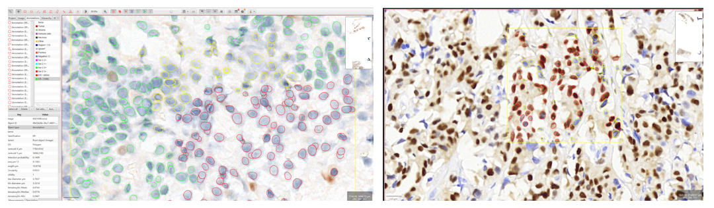
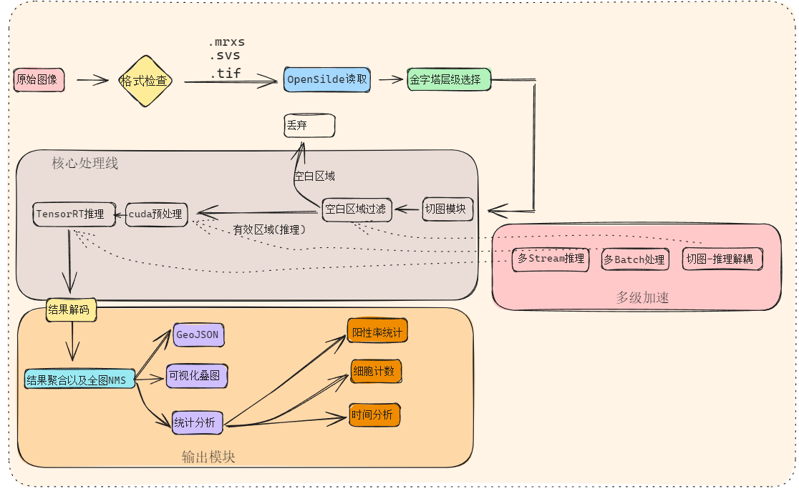
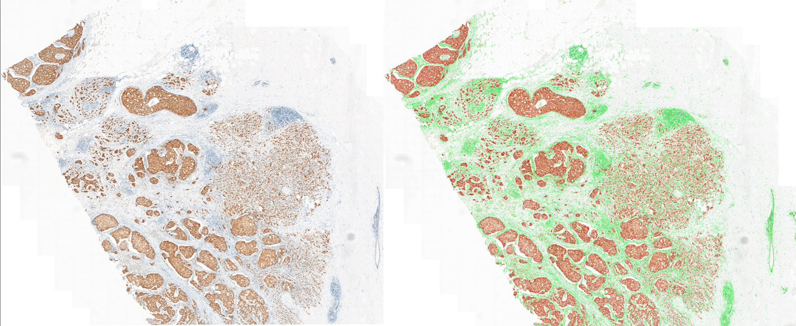
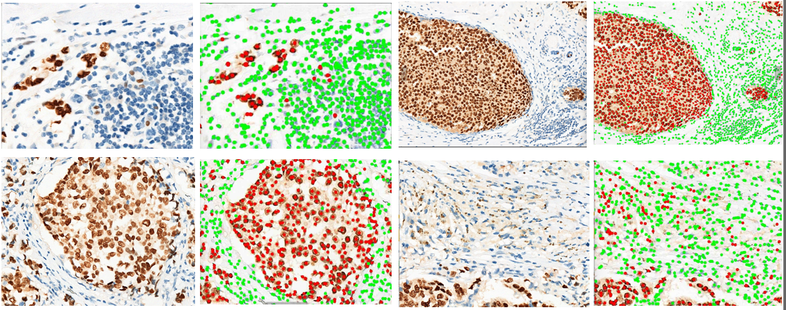
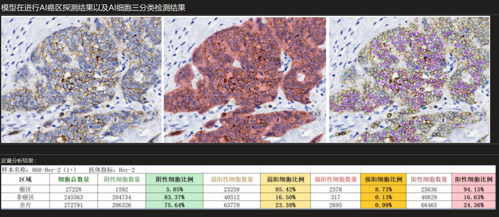

# ER 表达阳性/阴性的肿瘤细胞检测与推理（大尺寸图像推理）

该任务面向免疫组化切片图像中 ER 表达阳性/阴性的肿瘤细胞检测与分析，覆盖数据标注、模型训练以及TensorRT推理的全流程，支持大尺寸图像滑动裁剪 Patch 的批量推理与结构化结果输出。

> 该工程由自己独立完成，涵盖数据预处理、模型训练、滑窗推理与结果可视化等完整流程，由于工程中部分代码模块仍待整理和优化，目前暂不公开源码，仅展示任务流程与实验结果。

---

## 一、整体流程概述

- **标注与数据预处理**：
  
  - 基于 QuPath + StarDist 构建辅助标注流程：通过 QuPath 脚本随机选取多个有组织的ROI区域，然后通过 StarDist 细胞分割模型自动生成细胞轮廓分割结果，并手动修正漏检目标与细胞类别（阳性/阴性）；
  - 获取 ROI 区域的标注后，需要将 StarDist 输出的分割轮廓转换为目标检测任务的矩形框形式标签（bounding box）；
  - 从Whole Slide Image 中提取 ROI 图像区域及对应的目标检测标签，构建训练数据集；
  > - 注：由于免疫组化 ER 染色为核染，表达阳性与阴性的细胞特征较为直观，对专业医学知识的依赖较低，所以我对 StarDist 自动分割的结果进行了细胞类别的人工修正；
  > - 关于 StarDist 细胞分割算法的原理可参考： [StarDist细胞分割方法.md](../02_算法理解/StarDist方法结构梳理与原理理解笔记.md)

手动标注图像如下：



- **模型训练与导出**：
  
  - 基于 YOLOv8 训练细胞检测模型，并构建“预测 + 修正”的半自动标注流程，迭代扩充训练集，以持续提升 ER 阳性肿瘤细胞等小目标的检测性能；
  - 在模型导出阶段，我将 YOLOv8 模型转换为支持动态输入维度（包括 batch size 和图像尺寸）的 ONNX 格式，并设置了 min/opt/max 的动态 profile。随后基于该模型构建了 FP16 精度的 TensorRT 引擎，以支持在推理阶段按需调整 batch size；

- **TensorRT推理以及加速**：
  - 采用滑动窗口 + 重叠裁剪方式对大图分块，自动跳过空白区域，避免冗余计算；
  - 使用生产-消费模型解耦图像裁切与推理任务，其中推理线程采用多 CUDA Stream + 多 batch 推理，提高推理速度；
  - 基于 CUDA 实现图像预处理、图像NMS后处理以及全图后处理NMS；

- **结果输出与可视化**：
  - 推理输出经过全图级 NMS 聚合，最终结果以 GeoJSON 格式导出；
  - 结构化检测结果对接 QuPath 可视化，支持全图浏览与局部放大分析；
  - 支持大尺寸图像推理与阳性率统计，便于后续分析；

**小结**：

为了更系统地掌握大尺寸病理图像的推理流程，我从最基础的图像裁剪开始，逐步搭建并优化了推理过程。整个过程不是按照某种标准方案照搬，而是结合个人理解与实践需求，边做边调、逐步完善。中间遇到不少细节坑，比如图像格式兼容、边缘区域处理、重叠检测框去重等问题，最终形成了一套能在本地稳定跑通、具备一定效率的推理流程。流程图如下所示：

- 图像读取裁切这块用的是 OpenSlide，配合滑动窗口处理，裁切时会自动跳过空白区域，避免无效计算；
- 推理流程中通过引入简单的线程解耦机制，将图像裁剪与推理分离，避免因数据准备阻塞计算流程。虽然整体逻辑不复杂，但在提升了批量图像推理任务的运行效率；
- 后处理方面，全图级别做 NMS 去重，检测结果按 GeoJSON 格式结构化输出，方便和 QuPath 对接做可视化分析与阳性率统计；

过程中遇到几个关键细节问题，总结如下：

> - **坐标对不上的问题：** 原始图像是 .mrxs 格式，用 OpenSlide 无法准确获取到 QuPath 中的 ROI 区域DE 起始坐标，存在图层坐标偏移，应该和 3DHISTECH 的图像金字塔机制有关，OpenSlide 无法很好支持。最后，我直接使用 QuPath 导出的大尺寸 PNG 图像作为推理输入，暂时解决了坐标错位的问题。
>
> - **图像边缘目标漏检:** 在滑动裁剪patch 时，如果图像边缘剩下的部分不足一个完整 patch，默认会被丢弃，导致实际推理的时候，边缘区域经常漏掉边缘区域。通过对 Patch 的区域进行判断并进行边缘 padding 补齐操作，把不足 patch 的区域补成完整输入再推理，解决了边缘检测不完整的问题。
>
> - **重叠区域重复检测：** 滑窗重叠推理会导致重叠区域的目标重复被检测，尤其是密集细胞区域，拼接结果容易重复计数。通过将整张图划成不重叠 grid，然后判断每个目标检测框是不是落在 grid 边缘以及分界线上，如果是，就统一归到上一块 grid，然后进行 NMS ,以此完成对重叠区域目标的去重。
实际该阶段有两种做法：
>   - 只对重叠区域做 NMS，快速去重；如果滑窗推理中采用 640×640 patch 和 610 步长，存在 30 像素重叠。为避免重复统计目标，grid 边界应避开重叠区域，例如设置在 640–1220 区间，确保每个目标仅归属一个 grid；
>   - 对每个 grid 内所有目标重新聚合一次。第二种虽然计算量稍高，但结果更稳定，统计结果也更干净。那么这种方法需要注意的是左边界，需要小于当前重叠区域的左边界，大于上一个重叠区域的有边界，保证grid 区域仅包括重叠区域；
>
> - **生产线程裁剪的速度与推理线程的速度：** 只要生产速度 ≥ 推理速度，队列就不会空，推理线程就能持续取数据，不会阻塞等待。实际测试下来，生产线程裁剪速度通常能满足推理线程的需求。如果出现推理线程等待生产数据的情况，说明生产速度低于推理速度，需要调整生产速度或增加推理线程数量。



---

## 二、大尺寸图像推理效果示例（Region_736565184）

下图是实际大尺寸病理图像（38463 × 25295 ）使用TensorRT进行推理的结果。左侧为原始染色图像，右侧为检测结果可视化图，其中红色表示 ER 表达阳性的肿瘤细胞，绿色为阴性细胞。

本次推理共处理 1550 张有效 patch（跳过 1138 张空白区域），检测细胞目标总数约 185 万，经全图级 NMS 去重后结果数保持一致。推理平均耗时约为 41 ms / patch，整体推理耗时约 60 秒，显存占用稳定在 1.45 GB。整体结果表明，该流程在本地设备上能够稳定处理超高分辨率图像。

为进一步评估模型在微观层面的识别能力，下方展示了若干局部区域的原图与检测结果对比图。从可视化结果来看，模型在细胞密集、染色清晰的区域表现稳定，基本能够还原细胞分布与分类信息。




**推理日志**：

```bash

图像尺寸：38463 × 25295 px
Patch 总数：2688
有效推理 Patch 数：1550（跳过空白区域 1138）
总检测目标数：1,857,136
NMS 去重后目标数：1,856,679 
阳性细胞数：680,716（36.66%）
阴性细胞数：1,175,963（63.33%）
单 patch 平均推理耗时：**41.5 ms**
总推理时间：**60.6 秒**
GPU 显存使用：1.45 GB / 16 GB

```

---

## 三、任务背景与模型选择

**为什么要选择免疫组化 ER 表达阳性/阴性细胞检测这个任务**：

主要出发点有以下两点：

- **过往项目遗留问题：** 我在之前实习中曾参与类似任务（**乳腺癌 HER-2 表达细胞检测与分类** ），但当时只聚焦在模型训练本身，没能解决图像尺寸过大带来的推理效率瓶颈，也没有构建完整的部署流程。这次我想把整个流程补齐，从 0 开始独立完成。

- **ER 表达阳性相对可控：** ER 表达阳性是细胞核被染色，阳/阴性差异在图像中相对清晰，依赖的医学知识门槛不高，便于我在没有专业医生介入的情况下，独立完成标注和修正。

- **个人兴趣：**  实习中接触过相关任务，对细胞检测与大图推理流程具有一定兴趣，同时也有一定信心独立完成，也希望从这个任务中获得正向反馈，让我学习状态。

**对于密集小目标检测或者细胞核分割任务，有更好的检测方法，为什么选择 YOLOv8**:

尽管 YOLO 系列模型在处理高密度小目标任务上存在一定局限，特别是在目标重叠、尺寸微小的场景，但本项目仍选择使用 YOLOv8 作为检测模型，主要基于以下几点考虑：

- **YOLO训练模型以及后续推理流程完善：** YOLOv8 提供从模型训练、导出 ONNX 到 TensorRT 推理的完整流程，工具链成熟，易于构建高效的端到端部署 Pipeline，满足对大尺寸图像全流程处理的实践需求。

- **模型性能足够：** 尽管 YOLOv8 在细胞检测上可能不如专门的细胞分割模型（如 StarDist、HoverNet）精确，但在 ER 表达阳性/阴性细胞的分类任务中，其检测精度已经足够。

- **工程流程为主：**  该任务目标并非追求 ER 表达细胞的极致检测精度，而是聚焦于从标注、训练、加速推理到大图级别分析的完整流程的实现。这才是我关注的核心部分。

---

## 四、乳腺癌 HER-2 表达细胞检测---研究生实习（2023.9-2023.12）

该任务的核心目标是通过“癌区分割 + 细胞检测”的联合流程，辅助完成 HER-2 阳性率的自动统计与等级判定。我主要负责细胞检测模块，基于病理从业人员提供的标注数据，构建 HER-2 阳性与阴性细胞的检测模型，并参与部分癌区分割任务的实现。

虽然模型本身在静态 patch 上取得了不错的效果，但由于要返校完成大论文，导致后续全图处理流程、推理效率优化等问题没有被充分解决。这也是我后来重新构建 ER 检测任务的动因——一方面是延续我在 IHC 场景中的经验和兴趣，另一方面是希望在自己熟悉的任务背景下，独立从 0 到 1 走通包括数据准备、模型训练、推理部署、效率优化在内的整套流程，不再仅停留在模型本身调优的层面。

---

### 工作内容

该项目的目标是通过区域分割 + 细胞检测的方式，完成对 HER-2 蛋白表达状态的自动分析与分类评估。整体流程如下：

- **癌区分割：** 使用区域分割模型提取癌区与非癌区，为后续细胞级分析提供空间限定；
- **细胞检测与分类：** 对每个区域内的细胞进行检测，并判断其是否表达 HER-2 蛋白（阳性 / 弱阳性 / 阴性），生成对应检测框与分类标签；
- **结构化统计输出：** 统计各个癌区中的阳性细胞数量、比例、表达等级，并提供图像级评估指标；

我主要负责细胞检测模块的实现，具体包括：

- 基于病理专家提供的标注，构建 HER-2 阳性/阴性细胞检测数据集，并完成清洗与格式转换；
- 使用 YOLO 系列模型训练细胞检测器，支持高密度细胞识别与分类；
- 输出结构化检测结果，用于后续癌区筛选与 HER-2 阳性率统计；

下图展示的是多个 ROI（感兴趣区域）的检测可视化效果：以点的形式可视化细胞类别 HER-2 阳性（红/紫色圈）、弱阳性细胞（黄色圈）与阴性细胞（绿色圈），覆盖区域边界良好，能较好还原实际形态。此外，还展示了结合癌区域分割+细胞检测的检测结果，底部结果表格展示的是切片局部的统计数据，包括：切片编号、癌区细胞总数、阳性细胞数。

>注：该检测模型的推理结果在误差允许范围内，被认为**初步**可以接受。




---

## 五、个人收获与心得

通过参与 HER-2 表达细胞检测项目，我对大尺寸病理图像的处理流程有了更深入的理解，尤其是在数据标注、模型训练与推理部署方面。虽然项目中存在一些未能完全解决的问题，但这些经历为后续 ER 表达细胞检测任务打下了基础。
通过本次 HER-2 蛋白表达检测项目，我对病理图像中“区域分割 + 细胞检测 + 表达统计”的整体流程有了清晰认知，也首次系统性地参与了结构化结果输出与可视化设计。在实际落地过程中，我也切实遇到了一些典型问题，比如滑窗重叠区域细胞重复计数、图像边缘检测丢失等场景，虽当时未能深入解决，但已埋下继续探索的兴趣与方向。

因此在后续的 ER 表达细胞检测项目中，我决定围绕这些“曾经处理不充分”的环节重新设计推理流程，从滑动窗口裁剪、重叠区域优化、全图级 NMS 聚合到 TensorRT 高效推理加速，构建出完整的大图检测 Pipeline。某种程度上，这个项目既是对前一阶段经验的反思延续，也是我主动深入理解部署层面问题的一次自我挑战。
