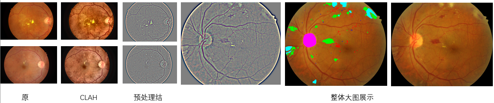
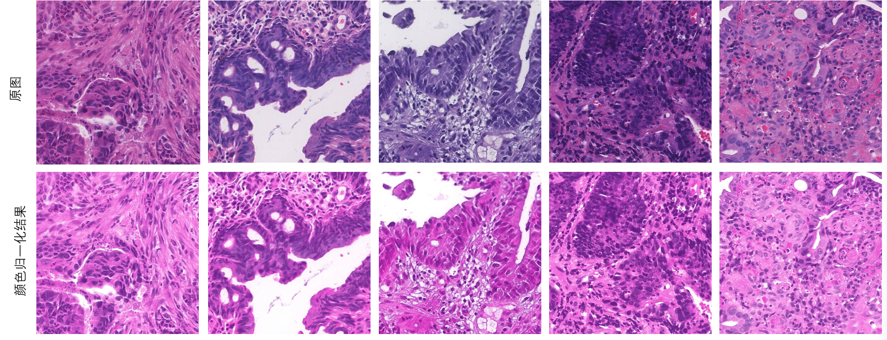
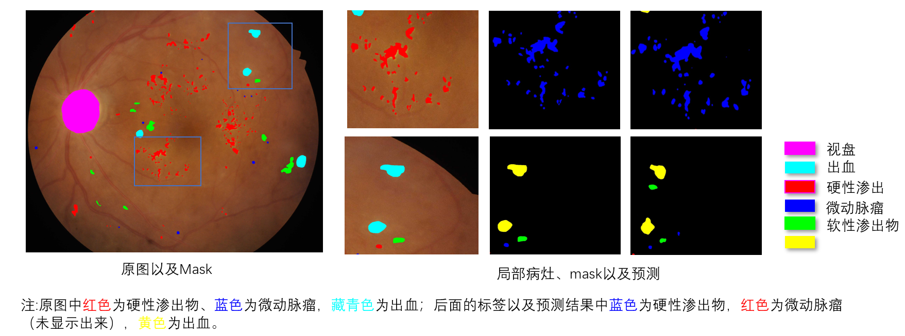
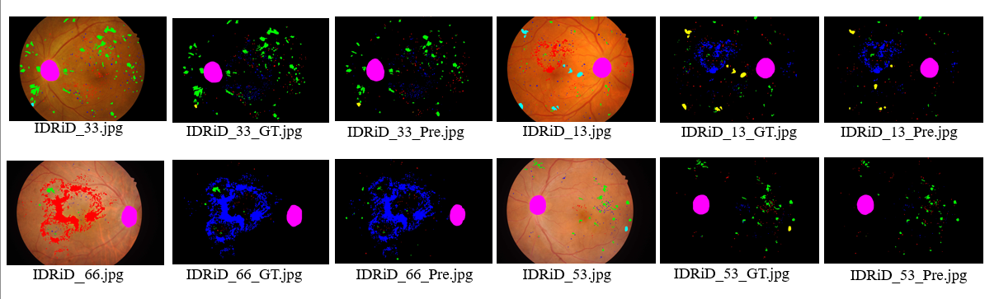
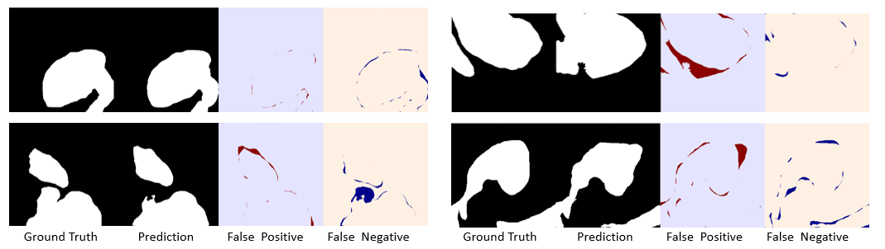
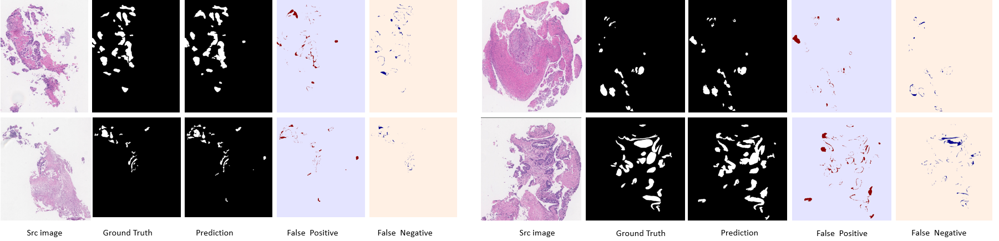
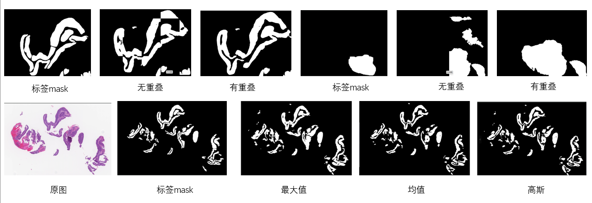

# 大尺寸医学图像的分割实验

该任务是对大尺寸医学图像中的病灶进行语义分割对比实验，主要围绕眼底图像中的多种病灶（如出血、微血管瘤、硬性渗出、软性渗出、视盘等）以及病理图像的恶性病灶区域。

> 所有实验结果与可视化均为独立训练与推理所得，非引用论文内容，由于实验代码模块较多，当前仅展示实验内容与结果，暂未上传源码。

---

## 一、实验内容

### 1. 数据预处理与样本生成

实验数据来源于两个高分辨率医学图像数据集：眼底图像（IDRID）和结肠镜病理检查图像（DigestPath 2019）。由于原始图像尺寸较大（通常为几千 × 几千像素），难以直接用于模型训练，因此在预处理阶段通过滑动窗口裁剪生成固定大小的 Patch，用于模型训练。

这两个数据集在病灶特征上存在显著差异，因此采用了不同的处理策略：

- 眼底图像（IDRID）：包含多种病灶类型（如出血、微血管瘤、硬性渗出等），为多类语义分割任务；
- 结肠镜病理图像（DigestPath 2019）：对来自不同医疗中心的病理组织图像进行二分类语义分割；

### 1.1 眼底图像

在视网膜病变图像分割任务中，图像病灶的类型与复杂度往往随病变程度而显著增加。不同病灶在颜色、形态和空间分布上的差异，对模型的判别能力要求也不同。例如，渗出物与出血在形态结构上显著不同，但渗出物与视盘的亮度特征相似，出血区域的色调又常与正常血管高度接近。这些视觉上的相似性，可能会导致模型在细粒度识别阶段产生混淆，尤其在边界模糊或区域过小的情况下更为明显。

基于这一认识，在实验初期，我尝试引入图像预处理，以提升病灶区域与背景之间的显著性。其中包含三个主要步骤：

- CLAHE（自适应直方图均衡化）：提升局部对比度，使低对比度病灶区域更清晰；
- 高斯滤波：抑制噪声，平滑纹理，降低图像冗余细节；
- 差值增强：将原图与模糊图进行加权相减，强化边缘轮廓，突出前景目标。

$$
  I_{(G)} = G_\varsigma * I_{(G)}
$$
$$
  G_\varsigma = \frac{1}{\sqrt{2\pi} \varsigma} \, e^{-\frac{x^2 + y^2}{2 \varsigma^2}}
$$
$$
  I_d = \omega \cdot I + \theta \cdot I_{(G)} + \varsigma
$$

其中，$\omega = 4$，$\theta = -4$，$\varsigma = 128$；

> 预处理方法来源于研究生阶段小论文 [特征自适应过滤的视网膜病变分级算法](http://www.txxb.com.cn/CN/Y2022/V43/I5/815)

该策略的灵感来自我研究生阶段进行糖尿病视网膜病变图像分类时的实践经验。尽管经过上述预处理之后，一些眼底图像能够提升病灶的清晰度，例如渗出以及较大的出血块与原图相比，在眼底图像中都更为明显，但也观察到经过预处理后的眼底图像也可能引入额外的伪影或者噪声，尤其在非病灶区域产生过度增强现象，该现象可能对模型的训练造成一定的干扰。

经过实验验证，在实际推理阶段，即便存在颜色干扰因素，模型对于视盘与血管区域的假阳性响应依然较低，这表明模型进行特征学习的时候，不仅依赖颜色特征，还会对特定解剖结构进行辨识，并利用结构、空间位置和上下文语义等信息，从而在排除非病灶背景（当然由于训练采用的是Patch，上下文信息有限，所以模型的性能可能会受到限制）。

眼底图像的 Patch 提取方式：

虽然原始数据集仅包含 65 张眼底图像，但采用滑动窗口裁剪（含重叠）构建训练集，会产生大量 Patch 图像。这种通用策略在病灶区域分布稀疏、面积较小的情形下，容易生成大量仅包含极少量前景像素甚至纯背景的 patch，降低了前景区域的有效利用率。

针对部分 patch 前景过少甚至缺失的问题，我通过对像素标签的类别进行采样，确保每类目标均能被充分覆盖，且前景目标位于 patch 中心，主要步骤：

- 类别引导采样：按类别标签信息提取 patch，确保每个采样区域包含对应类别的前景像素，避免纯背景 patch 干扰；
- 类别频次补偿：对于在图像中出现频次较低的类别，适当增加其采样数量，以缓解类别不均衡带来的偏差；
- 空间扰动增强多样性：为防止 patch 采样过于集中在同一区域，引入随机偏移扰动 patch 中心位置，提升 Patch 的空间多样性；

我分别对普通滑动裁剪（基础策略）与 类别引导采样（改进策略）进行了对比实验。在使用相同网络结构与训练设置的条件下，基于像素标签的类别进行采样的方法能够提升模型在小病灶区域的整体分割精度（提升 1.03% 的 Dice， 1.19% mIoU）。

---

### 1.2 结肠镜病理图像

经过阅读相关文献了解到，病理图像的染色效果在不同医疗中心之间差异较大，主要受到染色浓度、切片厚度、扫描设备以及制备流程等因素影响。这些因素会导致同一种组织在不同图像中的颜色表现不一致。如果不进行颜色归一化处理，模型可能会学习到与结构无关的颜色特征，进而影响对实际组织结构的识别。在恶性病灶区域分割任务中，这种染色差异甚至可能掩盖目标区域，导致模型漏检。因此，颜色归一化在病理图像预处理阶段是一个关键步骤。

常见的颜色归一化方法包括 Reinhard、Macenko 和 Vahadane。我使用的是 Vahadane 方法，它基于稀疏非负矩阵分解（SNMF），将图像分解为染色基（stain matrix）和浓度矩阵（concentration matrix），从而实现不同图像之间颜色风格的一致化，同时尽可能保留原始的结构信息。下图展示了使用 Vahadane 方法进行颜色归一化前后的图像对比效果：

> 关于 Vahadane 方法的原理以及计算过程，可以参考 [Vahadane颜色归一化方法.md](<../02_算法理解/Vahadane 染色归一化方法与数学推导.md>)

>注：使用该方法的原因来源该技术博客 [（染色归一化）病理图像（HE或者WSI）图像标准化方法小介绍](https://blog.csdn.net/qq_34616741/article/details/100541893)

病理图像的 Patch 提取方式：

在构建病理图像的分割训练数据时，我对原始高分辨率病理图像进行了滑动窗口裁剪，生成固定大小的 Patch。考虑到病灶区域通常较小且分布不均，采样过程中需兼顾小病灶区域的覆盖、组织结构的多样性以及正负样本的数量平衡。具体流程如下：

- 阳性样本（含病灶图像）
  - 跳过掩膜全为 0 的区域，只保留含前景的 Patch，优先选择前景像素占比较高的 Patch，避免训练中大部分区域为背景；
- 负样本（无病灶图像）
  - 尽量在组织结构清晰、分布均匀的区域中采样，同时也需要避免 Patch 过于集中；
- 样本比例控制
  - 最终 Patch 数据中，阳性与负样本数量比例约为 1 : 1，在保证前景信息充分的同时维持训练集的平衡；

---

## 2. 模型训练与推理

实验基于经典的医学图像语义分割网络 U-Net 及其改进结构展开，结合不同任务需求，对模型架构、损失函数和数据采样策略进行了多轮迭代与优化。由于实验方案持续调整，部分中间阶段的模型指标未被完整记录，但整体训练流程与设计逻辑已在本节中充分呈现。

---

### 2.1 眼底图像任务（多类小病灶分割）

在眼底图像的小病灶多类别分割任务中，共包含 6 类（背景 + 5 类病灻）。训练数据基于 65 张高分辨率眼底图像，经滑动窗口裁剪生成大小为 512×512、重叠度为 25% 的 patch 图像用于训练。模型结构采用 UNet、UNet++ 与 DeepLabV3+，编码器使用预训练的 EfficientNet-B0。图像增强使用 Albumentations 实现，包括随机翻转、亮度扰动、仿射变换与噪声添加等操作。损失函数采用 Dice Loss 与 Focal Loss 的加权组合，以应对类别不均衡与小目标分割问题。优化器为 AdamW，学习率调整策略为 ReduceLROnPlateau，根据验证集 Dice 系数与 mIoU 保存最优模型

### 2.2 病理图像任务（二分类小病灶检测）

训练数据来自高分辨率组织切片图像，裁剪为大小为 512×512、重叠度为 25% 的 patch，用于构建正负样本均衡的数据集。数据增强包括旋转、翻转与亮度扰动，增强模型对组织结构变化和染色差异的适应能力。损失函数采用 Tversky Loss 与 BCEWithLogitsLoss 的加权组合（比例为 0.6:0.4），以提升边界模糊区域与小病灶的识别性能。优化器为 AdamW，初始学习率设为 1e-4，使用 ReduceLROnPlateau 自适应调整；最终模型根据验证集 Dice 系数保存最优权重

---

### 2.3 实验结果

表中仅列出部分代表性结果以供参考。

| 模型名称     | Dice（眼底） | mIoU（眼底） | Dice（病理） | mIoU（病理） |
|--------------|--------------|--------------|--------------|--------------|
| UNet         | 0.8589       | 0.8815       | 0.9086       | 0.8650       |
| UNet++       | 0.8546       | 0.8111       | 0.9041       | 0.8579       |
| DeepLabV3+   | 0.8500       | 0.8099       | 0.9112       | 0.8673       |

表中列出了三种主流模型在眼底图像与病理图像任务中的代表性评估指标（Dice 与 mIoU）。从结果可见，各模型在不同任务中的性能表现存在差异：

- UNet： 在两个任务中均取得较高的 Dice 系数，整体表现稳定，具有良好的泛化能力，适合作为基线模型；
- UNet++： 尽管其嵌套结构有助于边界细节恢复，但在眼底图像任务中 mIoU 略低，可能对小病灶或复杂背景的适应性略逊；
- DeepLabV3+： 在病理图像任务中取得最高 Dice（0.9112），表明其基于空洞卷积和 ASPP 的结构更利于捕获上下文信息；但在眼底图像任务中性能相对较弱，可能与其对细粒度边界建模能力不足有关；

---

### 3. 大尺寸图像滑窗推理与后处理

因为整个流程都是基于 patch 的，所以我主要对比了两种滑窗方式：

- 滑窗无重叠：推理速度快，但边缘容易断，尤其是病灶刚好落在 patch 边缘时，可能会漏掉。
- 滑窗有重叠 + 融合：为了解决边缘断裂问题，引入重叠区域，然后用不同策略融合重叠区域的预测结果。

融合方式我试了三种：

- 最大值法：简单粗暴，哪个 patch 预测值大就用哪个。但有时候会导致边界不连续，看起来“跳”。
- 均值法：把多个 patch 的结果平均一下，平滑自然，但容易把病灶响应“拉低”。
- 高斯加权法：为每个 patch 生成以中心为权重峰值的高斯分布 mask，在融合阶段按像素加权叠加多个 patch 的预测结果。该方法能够有效平滑边缘接缝、强化中心区域响应，但在某些情况下可能引入局部假阳性，特别是在背景区域中心与前景区域中心权重相近时；

---

## 二、实验结果示例（小目标分割）

### 1. 眼底图像

对 IDRiD 数据集中的眼底图像进行病灶分割实验结果如下，模型**输出类别与颜色**约定如下：

| 病灶类别             | 英文名称           | 可视化颜色 |
|----------------------|--------------------|-------------|
| 微血管瘤             | Microaneurysms     | 红色        |
| 出血                 | Haemorrhages       | 绿色        |
| 硬性渗出物           | Hard Exudates      | 蓝色        |
| 软性渗出物           | Soft Exudates      | 黄色        |
| 视盘                 | Optic Disc         | 品红色      |

当前分割效果较好：

- 视盘（Optic Disc）识别较为稳定，预测区域完整，边界清晰，与真实结构高度一致，在所有样本中表现较好，说明模型对结构性强、形态稳定的目标较敏感。
- 硬性渗出物分割效果可接受，能较稳定检测出块状、高反光区域，有一定程度的区域完整性，误检率不高。

当前分割存在的问题：

- 微血管瘤检测存在较多假阳性，多处预测为红色点状区域，但在非病灶区域也有大量预测，小目标的分割能力有限。
- 软性渗出物容易漏检，初步分析原因是因为训练集中该类样本占比较少，或模型特征不敏感。
- 出血区域边界模糊、膨胀现象明显，与其他类别（如软渗）存在边界混淆，导致轮廓不规则或分类错误。

> 注：对小目标的分割能力不足，主要原因在于网络在下采样过程中会丢失大量细粒度信息，同时受限于感受野和特征整合方式，模型对局部区域的上下文建模能力有限。

可能优化方向：

- 引入多尺度结构（如 FPN 或金字塔池化模块）以增强模型对微血管瘤等小病灶的识别；
- 采用类别引导采样或调整类别损失权重，以提高模型对软性渗出物等低频类别的敏感性；
- 引入边界感知损失函数（如 Lovász Loss）与置信度平滑策略，提升模型对边界模糊区域的判别能力，降低假阳性发生率；

通过初步对比来看，有重叠的裁剪推理与均值的效果要好一些（这里在图中未被显示）。

>备注：当前模型更擅长识别结构性、区域明确的目标，如视盘、硬性渗出物。对于点状或边界模糊的类别（微血管瘤、软渗）较弱。

---

### 2. 病理图像

在 DigestPath 2019 病理图像分割实验中，模型在以下方面表现较好：

- 模型对病灶主体区域（如腺体团块）的分割效果较好，预测结果轮廓清晰、结构完整，尤其在染色均匀、背景干净的图像中，分割区域与人工标注高度一致；
- 图像中心区域的响应相对稳定，推测与 patch 中心特征信息更完整有关。滑动窗口推理中使用重叠裁剪和加权融合后，图像整体结构连贯性明显提升；
- 引入滑窗重叠和融合策略后，拼接边缘断裂的问题有一定程度缓解，尤其在结构连续区域更为明显；

当前观察到的问题：

- 模型对细小、孤立、条带状病灶识别能力不足，推理输出值偏低，阈值后易被过滤，出现假阴性。
- 错误主要分布在 patch 边缘区域，表现为轮廓不连续、断裂、偏移或形变，即使采用高斯加权融合，边缘响应仍不稳定；
- 部分空白或染色不均区域被误判为前景，表明模型可能受到背景纹理干扰，或训练中负样本标注覆盖不全；

后续优化方向：

- 可通过单独增强小病灶区域的采样或训练样本，增加难例覆盖，提升模型对小目标的敏感性（通过面积筛选，小块孤立区域）；
- 可引入边界约束损失函数（如 Lovász Loss）；
- 可清洗负样本标签并加强背景区域训练，同时在推理后加入小区域过滤，抑制离散误检；

>备注：实验验证了基础结构与滑窗策略的可行性，但分割质量仍受限于小目标建模、边缘一致性与结构复杂度的影响。

---

## 三、总结

本次实验围绕大尺寸医学图像的分割问题，结合眼底图像与病理图像两类任务，从数据预处理、Patch 构建、模型训练到滑窗推理进行了完整尝试。整体流程较为顺畅，基础网络（如 UNet 系列）在结构清晰区域效果较好，滑窗重叠+融合策略能显著改善接缝问题。

主要问题集中在：小病灶漏检、边缘预测不稳、假阳性分散与复杂结构处理不足。目前初步通过类别引导采样、边界损失与简单后处理尝试缓解，但仍存在一定局限。

整体来看，本轮实验验证了预处理、采样与融合策略的有效性，为后续优化模型结构（多尺度/边界引导等）提供了明确方向。后续考虑聚焦在小目标建模与边界处理上做深入改进。
