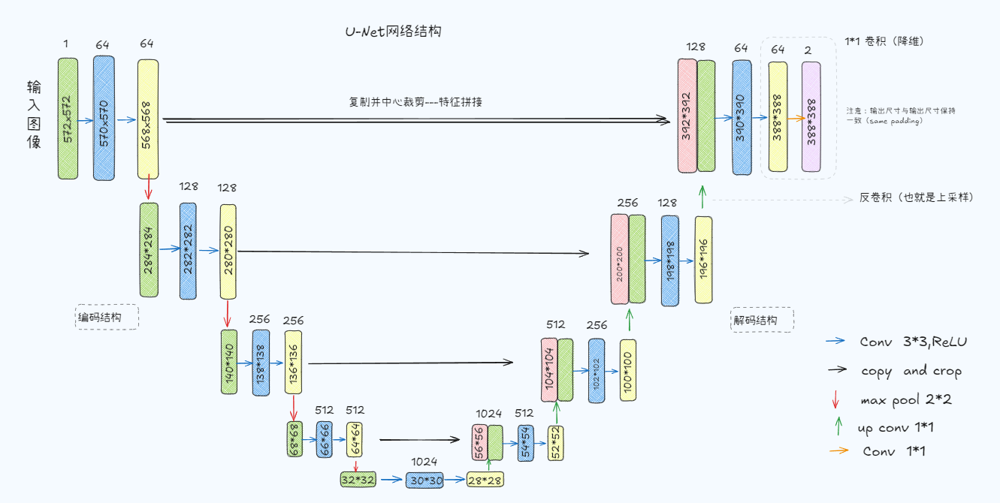

# U-Net网络

U-Net网络是一种用于图像分割的卷积神经网络架构，最初是为生物医学图像分割任务设计的。它的特点是使用了对称的编码器-解码器结构，能够有效地捕捉图像中的上下文信息，同时保留细节。

## 主要特点

1. **对称结构**：U-Net由一个收缩路径（编码器）和一个扩展路径（解码器）组成。编码器逐渐减少空间维度并增加特征通道，而解码器则逐渐恢复空间维度。
2. **跳跃连接**：在编码器和解码器之间使用跳跃连接，将编码器中相应层的特征图直接传递到解码器中。这有助于保留高分辨率的细节信息。
3. **多尺度特征融合**：U-Net在编码器中使用不同的卷积核大小（如3x3、5x5）来提取多尺度特征，这有助于捕获不同尺度的上下文信息。
4. **特征融合**：U-Net在解码器中使用特征融合模块，将编码器中不同层的特征图进行拼接，这有助于保留不同尺度的特征信息。
5. **上采样**：U-Net在解码器中使用上采样模块，将特征图的空间维度放大一倍，这有助于恢复高分辨率的图像。
6. **全卷积网络**：U-Net使用全卷积网络结构，没有全连接层，这使得它能够处理任意大小的输入图像。
7. **跳跃连接**：U-Net在编码器和解码器之间使用跳跃连接，将编码器中相应层的特征图直接传递到解码器中。这有助于保留高分辨率的细节信息。
8. **损失函数**：U-Net通常使用交叉熵损失函数或Dice系数作为损失函数，以优化分割结果。
9. **数据增强**：U-Net在训练过程中使用数据增强技术，如旋转、翻转、缩放等，以增加训练样本的多样性，提高模型的泛化能力。
10. **批归一化**：U-Net在卷积层后使用批归一化（Batch Normalization）来加速训练和提高模型的稳定性。
11. **Dropout**：U-Net在训练过程中使用Dropout层来防止过拟合，尤其是在解码器部分。
12. **激活函数**：U-Net在卷积层后使用激活函数（如ReLU）来引入非线性特征，这有助于提高模型的表达能力。
13. **输出层**：U-Net的输出层通常使用1x1卷积，将特征图映射到目标类别的数量，以生成最终的分割结果。
14. **多通道输出**：U-Net可以处理多通道输入和输出，适用于多类别分割任务。
15. **多尺度输入**：U-Net可以处理不同大小的输入图像，适用于多尺度图像分割任务。
16. **可扩展性**：U-Net的结构可以根据任务需求进行扩展或缩减，适用于不同规模的图像分割任务。
17. **迁移学习**：U-Net可以利用预训练的权重进行迁移学习，适用于小样本图像分割任务。
18. **注意力机制**：U-Net可以引入注意力机制，如通道注意力（Channel Attention）或空间注意力（Spatial Attention），以增强模型对重要特征的关注。
19. **多任务学习**：U-Net可以同时处理多个任务，如语义分割、实例分割等，适用于多任务图像分割任务。
20. **模型压缩**：U-Net可以通过模型压缩技术，如剪枝（Pruning）或量化（Quantization），以减少模型的参数数量和计算量，适用于资源受限的场景。
21. **模型解释**：U-Net可以通过可视化技术，如热力图（Heatmap）或梯度可视化（Gradient Visualization），来解释模型的决策过程，适用于模型解释任务。
22. **实时分割**：U-Net可以通过优化模型结构和算法，达到实时分割的效果，适用于实时图像分割任务。
23. **3D分割**：U-Net可以扩展到3D图像分割任务，适用于医学图像分割等3D图像分析任务。
24. **多模态分割**：U-Net可以处理多模态输入，如图像和点云数据，适用于多模态图像分割任务。
25. **半监督学习**：U-Net可以利用未标注数据进行半监督学习，适用于标注数据有限的场景。
26. **自监督学习**：U-Net可以利用未标注数据进行自监督学习，适用于标注数据有限的场景。
27. **无监督学习**：U-Net可以利用未标注数据进行无监督学习，适用于标注数据有限的场景。