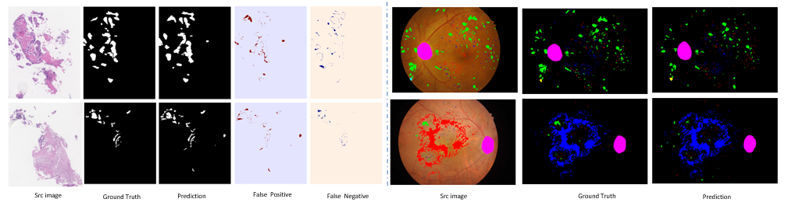

# 技术成长记录 · 项目实践与学习

建立这个仓库的目的是：把做过的事情、踩过的坑、想过的方案都留下痕迹，慢慢建立属于自己的知识体系。

>过去做过不少项目，也有过一些不错的想法，但因为没有及时整理，很多内容都慢慢被遗忘了，现在我希望能改变这一点——通过持续记录，把“做过”变成“留下”，把“解决过”变成“能复用”。

📌 这个仓库将长期用于积累与持续学习的输出

---

## 近期实践总结 · 从 0 到 1 实践

- [x] [乳腺癌 ER 表达细胞检测 · 全流程搭建与推理复盘（2025-08-01）](<01_项目复盘/乳腺癌 ER 表达细胞检测 · 全流程搭建与推理复盘.md>)：
  
  - 从标注构建 → 模型训练 → TensorRT 加速推理 → 可视化输出的完整闭环
  - 基于 QuPath + StarDist 构建细胞标注流程，并实现阳/阴性细胞分类
  - 自主解决大图滑窗推理中坐标偏移、边缘漏检、重复计数等难点
  - 使用 YOLOv8 + TensorRT 进行动态 batch 推理，结合 CUDA Stream 加速流程
  - 实测处理 1.8M+ 目标，平均推理耗时仅 41ms / patch
  
  

- [x] [高分辨率图像小病灶分割实验总结（2025-08-01）](<01_项目复盘/高分辨率图像小病灶分割实验总结.md>)：

  - 结合眼底图像（IDRiD）与病理图像（DigestPath），对比分析两类任务异同
  - 探索类别引导采样策略，显著提升小病灶覆盖率与类别平衡性
  - 系统比较多种滑窗融合方式（mean / max / gaussian），验证中心权重融合效果更优
  - 基于 Vahadane 方法完成病理图像染色归一化，提升模型跨机构泛化能力
  - 分析不同结构（UNet、UNet++、DeepLabV3+）在任务中的表现差异与边界建模局限
  - 包括模型选择、数据增强、后处理等方面的经验总结

  

## 算法结构 · 原理笔记与公式推导

- [x] [`StarDist 实例分割`](<02_算法理解/StarDist 方法结构梳理与原理理解笔记.md>)：《Cell Detection with Star-convex Polygons》  
- [x] [`Vahadane 染色归一化`](<02_算法理解\Vahadane 染色归一化方法与数学推导.md>)：《Structure-Preserving Color Normalization and Sparse Stain Separation for Histological Images》
- [ ] [`U-Net网络`](<02_算法理解\U-Net网络.md>)：《U-Net: Convolutional Networks for Biomedical Image Segmentation》
- [ ] [`U-Net++网络`](<02_算法理解\U-Net++网络.md>)：《UNet++: A Nested U-Net Architecture for Medical Image Segmentation》
- [ ] [`DeepLabV3+网络`](<02_算法理解\DeepLabV3+网络.md>)：《Encoder-Decoder with Atrous Separable Convolution for Semantic Image Segmentation》
- [ ] [`Vit网络`](<02_算法理解\Vit网络.md>)：《An Image Is Worth 16*16 Words:Transformers For Image Recognition at scale》
- [ ] [`Swin Transformer网络`](<02_算法理解\Swin Transformer网络.md>)：《Swin Transformer: Hierarchical Vision Transformer using Shifted Windows》
- [ ] [`HoverNet细胞核分割`](<02_算法理解\HoverNet细胞核分割.md>)：《HoVer-Net: Simultaneous Segmentation and
Classification of Nuclei in Multi-Tissue Histology
Images》
  
---

## 🧊 杂项 · 草稿区（Unsorted / Playground）

记录一些临时想法、小工具、环境搭建、调试经验等，方便日后统一整理。

- [x] [`QuPath 工具脚本`](<03_工具脚本\QuPath\QuPath 脚本工具.md>): 用于在 QuPath 中处理数字扫描切片数据；
- [x] [`研究生论文`](<04_研究生论文\论文说明.md>): 研究生阶段的小论文；
- [x] [`Python 工具脚本`](<03_工具脚本\Python\Python 脚本工具.md>): 实践中使用到的一些脚本工具(整理中)
- [ ] [`胡思乱想`](<06_工作区\头脑风暴.md>)：头脑风暴（）

---

## 🧩 进行中 / 计划中

- [ ] 工程代码模块整理与开源脚本发布

- [ ] 多模态任务探索（图像 + 文本）

---
